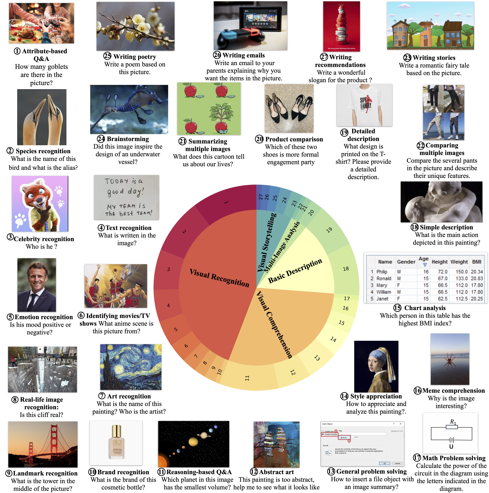
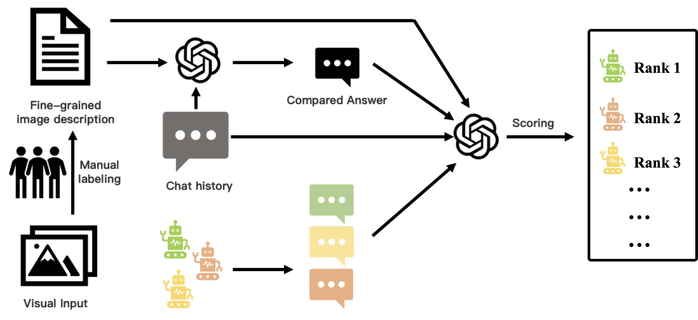
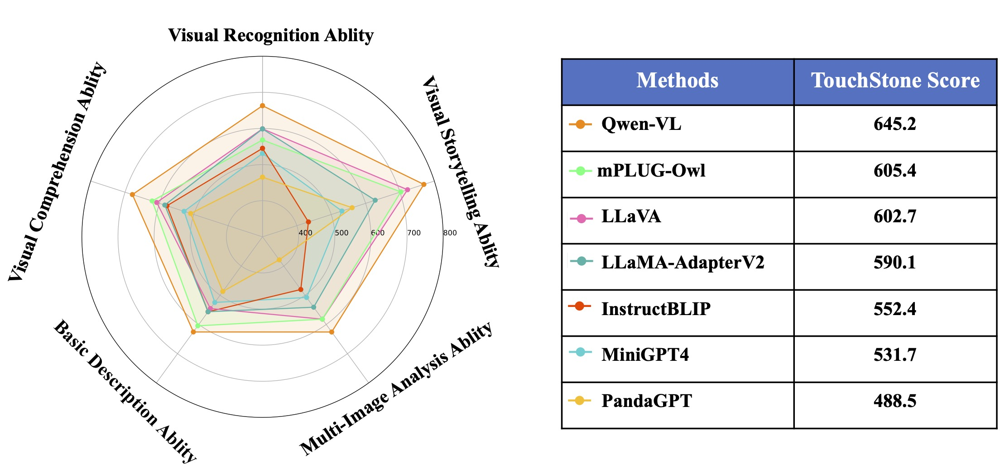

<br>
<p align="center">
    
<p>
<br>
<div align="center">
<h1>TouchStone: Evaluating Vision-Language Models by Language Models

[](https://arxiv.org/abs/2308.16890)
</div>

> **TOUCHSTONE** is a comprehensive assessment of multimodal language models, encompassing not only basic recognition and comprehension but also extending to literary creation. By using strong LLMs as judges and converting multimodal information into text, our TouchStone allows for efficient and accurate assessment of dialogue quality, leveraging the power of advanced language models without the need for manual intervention.

## DATASET

TouchStone is a diverse and comprehensive dataset that covers five key dimensions: **Basic Descriptive Ability**, **Visual Recognition Ability**, **Visual Comprehension Ability**, **Visual Storytelling Ability**, and **Multi-image Analysis Ability**. You can download the dataset [here](https://touchstone-beijing.oss-cn-beijing.aliyuncs.com/dataset/touchstone_20230831.tsv).

<p align="center">
    
<p>

Our dataset currently places more emphasis on assessing basic abilities, where the highest proportion of questions pertains to recognition, accounting for about 44.1\%, followed by comprehension questions at 29.6\%. The proportions of the other categories are 15.3\% for basic descriptive ability, 7.4\% for visual storytelling ability, and 3.6\% for multi-image analysis ability. There are a total of 908 dialogue.

## Methods
TouchStone leverages fine-grained annotation and strong LLMs to evaluate LVLMs. Firstly, fine-grained descriptions of images are obtained through manual annotation and inspection. These descriptions, along with questions, are fed into GPT-4 (text-only) to generate reference answers. On the other hand, different LVLMs directly take visual signals and questions as input to generate answers. The generated answers, reference answers, questions, and fine-grained descriptions are all scored by GPT-4. The final scores are averaged and used to rank the models, representing their comprehensive performance.
<p align="center">
    
<p>
    
## New Results

    
| Rank |                            Model                             |     Score    |
| :--: | :----------------------------------------------------------: |  :---------: |
|  🏅️   |     **[GPT-4V](https://platform.openai.com/docs/guides/vision)** |  **803.5**  |
|  🥈   |     **[CogVLM](https://github.com/THUDM/CogVLM)**                |   **742.0** |
|  🥉   |     **[Qwen-VL](https://github.com/QwenLM/Qwen-VL)**             | **711.6**   |
|  4   |      [Emu2](https://github.com/baaivision/Emu/tree/main/Emu2)     |   703.8     |
|  5   |      [mPLUG-Owl](https://github.com/X-PLUG/mPLUG-Owl)             |    605.4    |
|  6   |      [LLaVA](https://github.com/haotian-liu/LLaVA)                |    602.7    |
|  7   |      [LLaMA-AdapterV2](https://github.com/OpenGVLab/LLaMA-Adapter) |    590.1   |
|  8   |      [InstructBLIP](https://github.com/salesforce/LAVIS/tree/main/projects/instructblip) |   552.4   |
|  9   |      [MiniGPT4](https://github.com/Vision-CAIR/MiniGPT-4)         |    531.7   |
|  10  |      [PandaGPT](https://github.com/yxuansu/PandaGPT)              |    488.5   |

## Evaluation Results

<p align="center">
    
<p>


## Run Evaluation

<details>
  <summary>Read image</summary>

```python
import io
import base64
import pandas as pd
from PIL import Image

def decode_base64_to_image(base64_string):
    image_data = base64.b64decode(base64_string)
    image = Image.open(io.BytesIO(image_data))
    return image

df = pd.read_csv("touchstone_20230831.tsv", sep='\t')
index = 0
image = decode_base64_to_image(df.iloc[index]['image'])
question = df.iloc[index]['question']
human_annotation = df.iloc[index]['human_annotation']
gpt4_ha_answer = df.iloc[index]['gpt4_ha_answer']
category = df.iloc[index]['category']
task_name = df.iloc[index]['task_name']
```

</details>

<details>
  <summary>Format requirement</summary>

- The submitted file should be in CSV format with the delimiter set as '\t'. 
- The submitted file must contain the following fields: index, question, human_annotation, gpt4_ha_answer, category, task_name, and response. The "response" field represents the model's answer, while the other fields should match the [evaluation dataset](https://touchstone-beijing.oss-cn-beijing.aliyuncs.com/dataset/touchstone_20230831.tsv) file.
- The number of rows in the submission.xlsx file (excluding the header) should be consistent with the evaluation dataset, which is 908 rows.

</details>

The evaluation script is provided in [eval.py](eval.py). 

```shell
python eval.py submit_file openai_key --model-name your_model 
```

## Citation

```
@misc{bai2023touchstone,
      title={TouchStone: Evaluating Vision-Language Models by Language Models}, 
      author={Shuai Bai and Shusheng Yang and Jinze Bai and Peng Wang and Xingxuan Zhang and Junyang Lin and Xinggang Wang and Chang Zhou and Jingren Zhou},
      year={2023},
      eprint={2308.16890},
      archivePrefix={arXiv},
      primaryClass={cs.CV}
}
```
